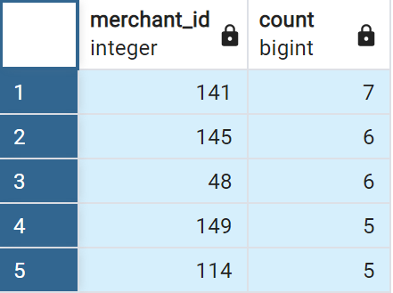

# Unit 7 Homework Assignment: Looking for Suspicious Transactions

## Data Modeling:
Define a database model to store the credit card transactions data and create a new PostgreSQL database using your model.

**Database Model:**

            Cardholder
        -
        holder INT PK 
        name VARCHAR(255)

        Creditcard
        -
        card_id VARCHAR(20) PK
        holder_id INT FK >- Cardholder.holder

        Merchant
        -
        merchant_id INT PK
        name VARCHAR(255)
        merchant_cat_id INT FK - Merchantcat.merchant_cat_id 

        Merchantcat
        -
        merchant_cat_id INT PK
        merchant_cat_name VARCHAR(255)

        Transaction 
        -
        transaction_id INT PK
        date TIMESTAMP
        amount FLOAT
        card VARCHAR(20) FK >- Creditcard.card_id
        merchant_id INT FK >- Me

## Data Engineering:
 Create a database schema on PostgreSQL and populate your  database from the CSV files provided.

            -- Exported from QuickDBD: https://www.quickdatabasediagrams.com/
        -- NOTE! If you have used non-SQL datatypes in your design, you will have to change these here.

        CREATE TABLE "Cardholder" (
            "holder" INT   NOT NULL,
            "name" VARCHAR(255)   NOT NULL,
            CONSTRAINT "pk_Cardholder" PRIMARY KEY (
                "holder"
            )
        );

        CREATE TABLE "Creditcard" (
            "card_id" VARCHAR(20)   NOT NULL,
            "holder_id" INT   NOT NULL,
            CONSTRAINT "pk_Creditcard" PRIMARY KEY (
                "card_id"
            )
        );

        CREATE TABLE "Merchant" (
            "merchant_id" INT   NOT NULL,
            "name" VARCHAR(255)   NOT NULL,
            "merchant_cat_id" INT   NOT NULL,
            CONSTRAINT "pk_Merchant" PRIMARY KEY (
                "merchant_id"
            )
        );

        CREATE TABLE "Merchantcat" (
            "merchant_cat_id" INT   NOT NULL,
            "merchant_cat_name" VARCHAR(255)   NOT NULL,
            CONSTRAINT "pk_Merchantcat" PRIMARY KEY (
                "merchant_cat_id"
            )
        );

        CREATE TABLE "Transaction" (
            "transaction_id" INT   NOT NULL,
            "date" TIMESTAMP   NOT NULL,
            "amount" FLOAT   NOT NULL,
            "card" VARCHAR(20)   NOT NULL,
            "merchant_id" INT   NOT NULL,
            CONSTRAINT "pk_Transaction" PRIMARY KEY (
                "transaction_id"
            )
        );

        ALTER TABLE "Creditcard" ADD CONSTRAINT "fk_Creditcard_holder_id" FOREIGN KEY("holder_id")
        REFERENCES "Cardholder" ("holder");

        ALTER TABLE "Merchant" ADD CONSTRAINT "fk_Merchant_merchant_cat_id" FOREIGN KEY("merchant_cat_id")
        REFERENCES "Merchantcat" ("merchant_cat_id");

        ALTER TABLE "Transaction" ADD CONSTRAINT "fk_Transaction_card" FOREIGN KEY("card")
        REFERENCES "Creditcard" ("card_id");

        ALTER TABLE "Transaction" ADD CONSTRAINT "fk_Transaction_merchant_id" FOREIGN KEY("merchant_id")
        REFERENCES "Merchant" ("merchant_id");

        -- Validate import CSV files
        SELECT * FROM "Cardholder";
        SELECT * FROM "Creditcard";
        SELECT * FROM "Merchant";
        SELECT * FROM "Merchantcat";
        SELECT * FROM "Transaction";

## Data Analysis:
 Analyze the data to identify possible fraudulent transactions trends data, and develop a report of your observations.

 ### Part 1: 

 Some fraudsters hack a credit card by making several small transactions (generally less than $2.00), which are typically ignored by cardholders.

- How can you isolate (or group) the transactions of each cardholder?
            
        -- Create a view for transaction with less than $2.00

        CREATE VIEW fraud1 AS
        SELECT *
        FROM "Transaction" as a
        INNER JOIN "Creditcard" as b ON a.card = b.card_id
        INNER JOIN "Cardholder" as c ON c.holder= b.holder_id
        WHERE amount <2;

        SELECT * FROM fraud1;

- Count the transactions that are less than $2.00 per cardholder.

            -- Count number of small transaction per cardholder
            SELECT name, count(*)
            FROM fraud1 
            GROUP by name 
            ORDER by count(*) Desc

- Is there any evidence to suggest that a credit card has been hacked? Explain your rationale.

    Maybe first 3 card holders that have more than 20 low value transaction should be check in detail.

Take your investigation a step futher by considering the time period in which potentially fraudulent transactions are made.
- What are the top 100 highest transactions made between 7:00 am and 9:00 am?

        -- Create a view for transaction between 7am and 9am 
        CREATE VIEW fraud2 AS
        SELECT *
        FROM "Transaction"
        WHERE EXTRACT(HOUR FROM date)>=7 and  EXTRACT(HOUR FROM date)<9
        ORDER by amount Desc
        LIMIT 100

        SELECT * FROM fraud2;

- Do you see any anomalous transactions that could be fraudulent?

    Transaction with more than $100 could be fraudulent. 

- What are the top 5 merchants prone to being hacked using small transactions?

        -- Top 5 merchant with small transaction 
        SELECT  merchant_id, count(*)
        FROM fraud1
        GROUP by  merchant_id 
        ORDER by count(*) Desc
        LIMIT 5

### Part 2: 

- [Visualizations Notebook ](visual_data_analysis.ipynb)
- [Challenge Notebook](challenge.ipynb)

